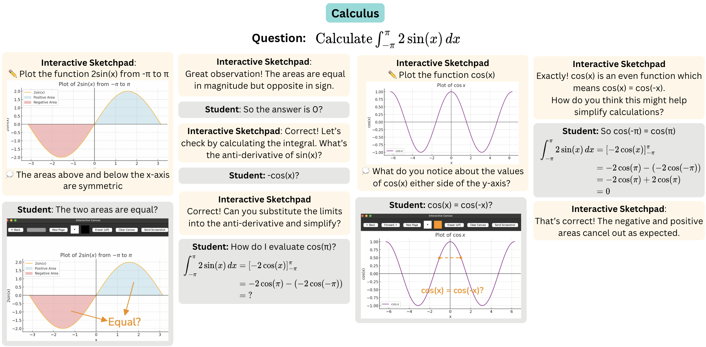
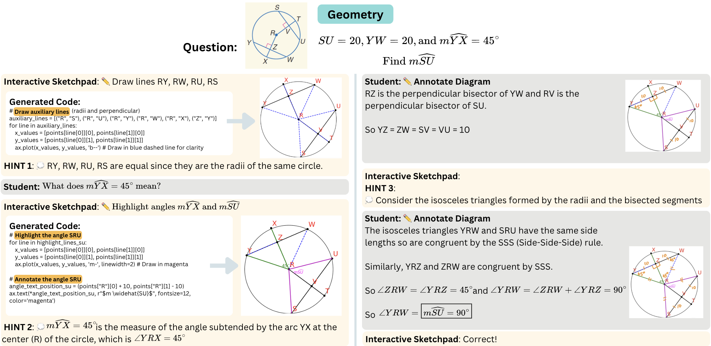

# Interactive Sketchpad: An Interactive Multimodal System for Collaborative, Visual Problem-Solving

This repo contains the official code for Interactive Sketchpad, an interactive multimodal visual problem solving system that combines language-based explanations with interactive visualizations to enhance human understanding.
Built on a pre-trained LMM, Interactive Sketchpad is fine-tuned to provide step-by-step guidance in both text and visuals, enabling natural multimodal
interaction with humans. Accurate and robust diagrams are generated by incorporating code execution into the reasoning process.

## Introduction

Interactive Sketchpad generates a program
to create a visual aid, then uses the visual aid as part of a hint to help the user solve the problem. The visual aid is sent to an
interactive whiteboard which the user can write and draw on before sending the annotated diagram back to receive feedback or
further help.

## Installation
1. Install uv https://docs.astral.sh/uv/getting-started/installation/
2. Run `uv sync` to install dependencies

## Running Interactive Sketchpad
Add your OpenAI API Key in a .env file
`OPENAI_API_KEY="YOUR_KEY_HERE"`

To run interactive sketchpad, do:
`cd interactive_sketchpad`

Start the server using the command:
`uv run uvicorn main:app --host 127.0.0.1 --port 8000`

Then go to the following link:
`http://127.0.0.1:8000/interactive_sketchpad/`

and it will open up Interactive Sketchpad and the whiteboard.
